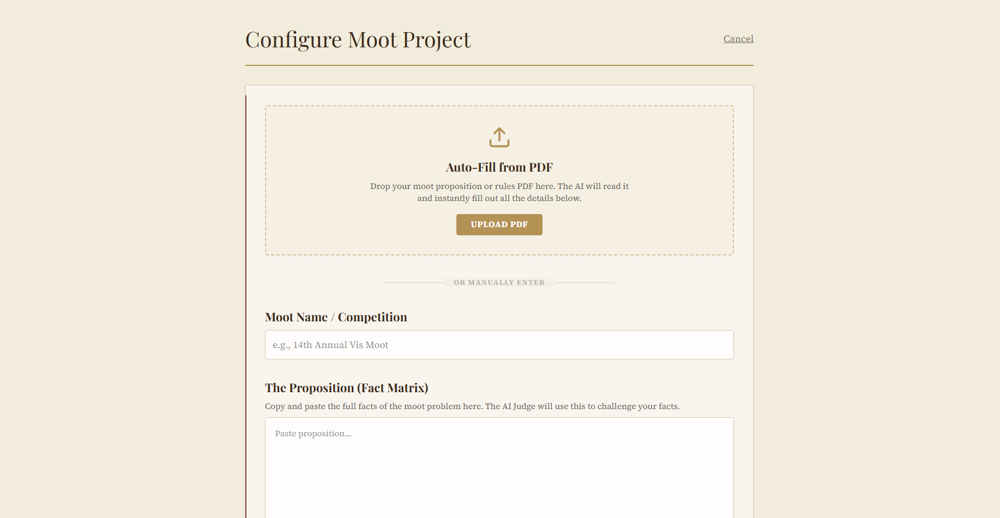
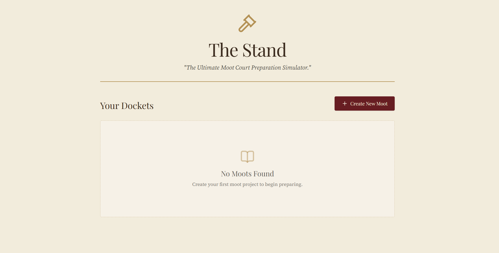

  # ⚖️ Amicus: The Ultimate Moot Court Simulator
  
  **Transforming how law students and practitioners prepare for appellate advocacy.**

 

Amicus is a full-stack, AI-powered moot court preparation platform. Instead of generic chatbot interfaces, Amicus provides a highly specialized, courtroom-themed simulator where an **AI Judge** actively cross-examines you on your legal arguments.

Built for hackathons and legal-tech innovation, Amicus handles the entire moot lifecycle: from parsing raw proposition PDFs to generating real-time counter-arguments.

---

## ✨ Key Features

### 📄 1. One-Click Moot Setup (AI PDF Extraction)
Don't waste time typing out factual matrices. Simply drag and drop your Moot Proposition PDF into the dashboard. Using Google's Gemini Flash, Amicus instantly reads the document and auto-fills the Case Name, Factual Proposition, Legal Issues, and Rules.

<!-- Placeholder for setup screenshot -->

  

### ♟️ 2. Strategy & Memorial Integration
Choose your side (Applicant or Defendant). Upload or paste your written **Memorial** before the session begins. The AI Judge reads your memorial in advance to anticipate your case theory and find the specific holes in your logic.

### 🏛️ 3. The Oral Arguments Simulator
Step up to the podium. Submit your oral arguments to the court. 
*   **The Catch:** If your argument is flawed, or if you ignore a bad fact from the proposition, the AI Judge will ruthlessly interrupt you with a piercing, skeptical question.
*   If your logic holds up, the Judge will allow you to proceed to your next issue.

<!-- Placeholder for oral arguments screenshot -->

  

### ⚔️ 4. Rebuttal Strategy Assistant
Stuck on what the opposing counsel might say? The Rebuttal Assistant acts as your co-counsel. It predicts the three strongest arguments your opponent is likely to make, and arms you with suggested rebuttals and cross-questions.

---

## 🛠️ Tech Stack

*   **Frontend:** React 18, Vite, Tailwind CSS (Custom courtroom-themed design tokens), Lucide React.
*   **Backend:** Node.js, Express, `multer` (in-memory file handling), `pdf-parse` (V2 Pure TypeScript edition).
*   **AI Engine:** Google Gemini SDK (`gemini-3.6-flash`).

---

## 🚀 Running Locally

### Prerequisites
*   Node.js (v20 or higher)
*   A Google Gemini API Key

### 1. Setup the Backend
\`\`\`bash
cd server
npm install
\`\`\`
Create a `.env` file in the `server` directory and add your Gemini key:
\`\`\`env
GEMINI_API_KEY=your_api_key_here
PORT=3005
\`\`\`
Start the backend:
\`\`\`bash
npm run dev
\`\`\`

### 2. Setup the Frontend
Open a new terminal window:
\`\`\`bash
cd client
npm install
\`\`\`
Create a `.env` file in the `client` directory (optional, defaults to localhost:3005):
\`\`\`env
VITE_API_URL=http://localhost:3005
\`\`\`
Start the frontend:
\`\`\`bash
npm run dev
\`\`\`

Navigate to `http://localhost:5173` to start practicing your oral arguments!

---
*Built with ❤️ for Legal-Tech Innovation.*
